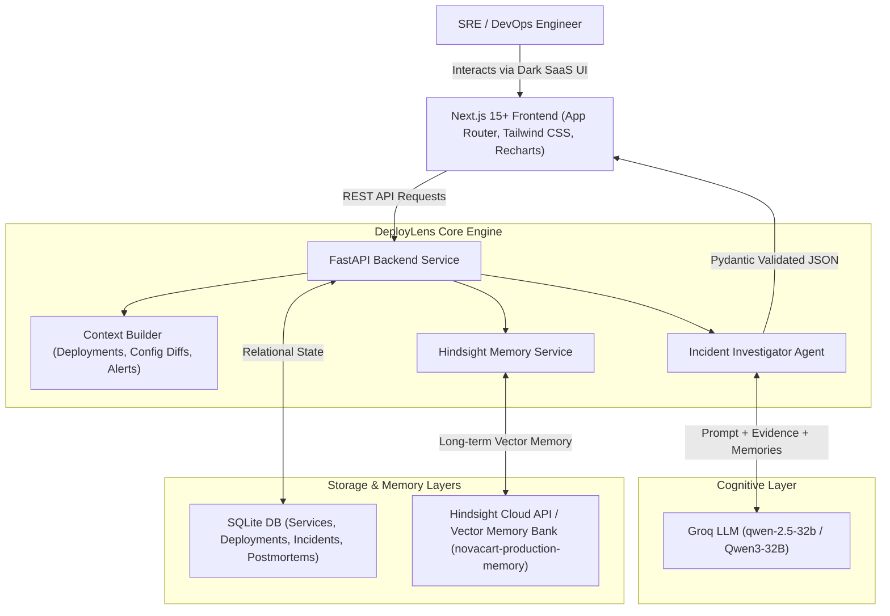

# DeployLens Architecture Specification

## Overview

**DeployLens** is a memory-powered production incident investigation agent designed for DevOps, Site Reliability Engineers (SREs), and platform engineering teams. 

Unlike generic stateless chatbots or standard RAG search tools, DeployLens centralizes persistent **Hindsight long-term operational memory**. It answers:
> *"What changed before production broke, have we seen this failure before, and what actually worked last time?"*

---

## High-Level System Architecture

---

## Component Breakdown

### 1. Frontend Layer (`frontend/`)
- **Framework**: Next.js 15+ App Router, TypeScript, Tailwind CSS, Lucide icons, Recharts.
- **Key Modules**:
  - `Navbar.tsx`: Live Hindsight connection status indicator.
  - `InvestigationView.tsx`: Multi-stage progress tracking for incident correlation.
  - `HaveWeSeenThisView.tsx`: Hindsight vector recall breakdown showing similarity scores, symptoms, and previous fixes.
  - `FailedFixCard.tsx`: Highlights historical anti-patterns and failed fix attempts.
  - `BeforeAfterComparison.tsx`: Direct side-by-side comparison of stateless AI vs Hindsight memory.
  - `ResolutionModal.tsx`: Captures root cause, fix, and failed attempts to trigger the Hindsight memory learning loop.

### 2. Backend Layer (`backend/`)
- **Framework**: FastAPI (Python 3.12), Pydantic v2, SQLAlchemy.
- **Key Subsystems**:
  - `app/memory/hindsight_client.py`: Official Python `hindsight-client` wrapper with fallback handling.
  - `app/memory/memory_service.py`: High-level manager executing `remember_event()`, `recall_memories()`, `store_incident_outcome()`, etc.
  - `app/memory/memory_formatter.py`: Transforms raw events into semantic memories.
  - `app/agents/investigator.py`: Core 10-step investigation pipeline with evidence-first reasoning and strict schema validation.

### 3. Hindsight Memory Bank Strategy
- **Bank Identifier**: `novacart-production-memory`
- **Memory Unit Types**: `deployment`, `incident`, `investigation`, `resolution`, `failure`, `learning`.
- **Outcome Awareness**: Retains not only raw events but verified operational outcomes (e.g., successful fixes vs temporary/failed attempts).
